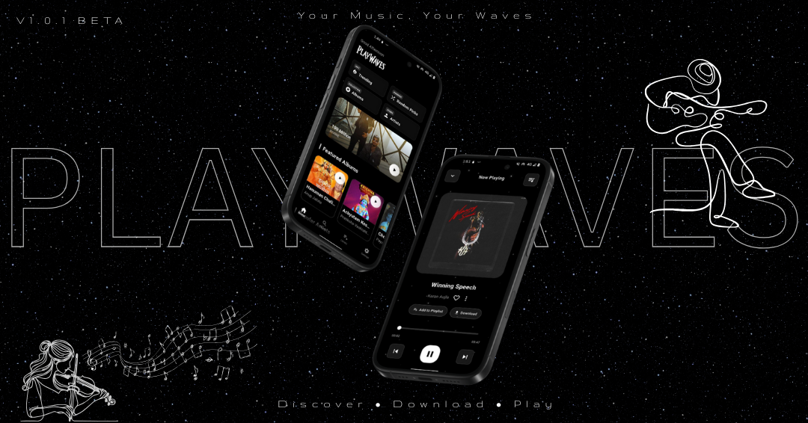

# 🌌 PlayWaves — Your Galaxy of Music 🚀

Welcome to **PlayWaves**, the ultimate online music streaming app designed to deliver a cosmic listening experience like no other.  
Dive deep into a universe of sound, beauty, and personalization — all wrapped in a stunning galaxy stars theme!

## 🎧 What is PlayWaves?

PlayWaves is more than a music app — it’s your portal to high-quality audio, dazzling visuals, and total control over your listening environment.  
Whether you love discovering new tracks, building playlists, or customizing your app’s look, PlayWaves puts the galaxy in your hands.

## ✨ Key Features

- **🎶 Crystal Clear Streaming:** Enjoy your favorite songs in ultra-high 320kbps quality for the richest, clearest sound.

- **💫 Animated Galaxy UI:** Be mesmerized by smooth, starry animations and a modern, glass-inspired mini player with wave ripple effects.

- **⬇️ Download Songs:** Save any track for offline listening with a single tap.

- **🎵 Playlist Management:** Create, edit, and organize your playlists with ease. Every playlist is securely synced to Firebase, so your music travels with you.

- **❤️ Like Songs:** Mark your favorites and access them instantly across all devices.

- **🌠 Galaxy Stars Theme:** Immerse yourself in a cosmic aesthetic with animated backgrounds and celestial colors.

- **🎨 Full Customization:**  
   - Select your own primary and secondary colors using a powerful RGB mixer.  
   - Apply premade Material Design color presets for instant style.

- **⚙️ Fine-Tune Your Experience:**  
   - Choose your preferred download and streaming quality in the settings.  
   - Customize the app’s look and feel to match your mood.

- **🦋 Mini Glass Player:** Access your music with a stylish glass-themed mini player featuring wave ripple animations for a futuristic vibe.

- **🔄 Cloud Sync:** All your playlists and liked songs are automatically synced to Firebase for seamless access.

- **🔑 Google Email Login:** Sign in securely and effortlessly with your Google account.

- **📊 Real-Time Stats:** Track your listening journey with live stats that count minutes listened, number of songs played, and songs downloaded.

## 🚀 Why Choose PlayWaves?

- **Personalized for You:** Mix and match colors, themes, and presets to make PlayWaves truly yours.

- **Always Connected:** Your music library, playlists, and likes are synced across devices — never lose a beat.

- **Stunning Visuals:** Enjoy a visually captivating interface inspired by the mysteries of the universe and cutting-edge design.

- **Total Control:** From audio quality to downloads, you decide how you experience your music.

- **Effortless Access:** Quick Google email login and automatic cloud syncing keep your music world organized.

---

**Ready to experience music like never before?  
Join PlayWaves and let your listening journey take flight among the stars!**

Special Thanx to @darkx-dev(bug fixes) and Susime (for logo)
